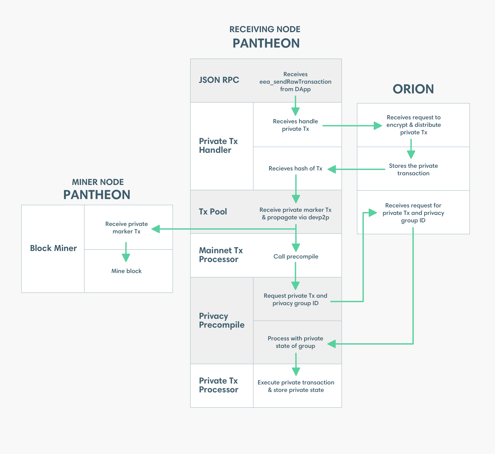

# Privacy

Privacy in Pantheon refers to the ability to keep transactions private between the 
involved parties. Other parties have no access to the transaction content, the sending party, or the 
list of participating parties. 

This page describes what private transactions are and how they are processed in Pantheon. Other pages describe:

* How to configure Pantheon and the Private Transaction Manager (for example, Orion) to send private transactions
* Creating and sending private transactions 

## Private Transactions

Private transactions are defined as *restricted* or *unrestricted*:  

* In restricted private transactions the payload of the private transaction is stored only in the nodes
participating in the transaction. 

* In unrestricted private transactions the payload of the private transaction is transmitted to all nodes
in the network but is readable only by actors involved in the transaction.   

!!! important 
    Pantheon implements restricted private transactions only.

## Privacy Concepts

Processing private transactions involves the following concepts: 

- **Precompiled Contract**: Smart contract compiled from the source language to EVM bytecode and stored by an 
Ethereum node for later execution.

- **Private State**: Data that is not shared in the globally replicated world state. Private state
data can represent arrangements involving multiple parties. For example, data in private transactions.

- **Actor**: Public key involved in a private transaction (for example, public key of the sender).

- **Privacy Group ID**: Unique ID associated with the set of actors involved in a private transaction.

- **Private Transaction**: Transaction where some information (for example, the payload data, or sender and
 receiver) is available only to the actors involved in the transaction.

- **Private Transaction Manager**: Network subsystem for implementing privacy. Also known as an Enclave.
For example, [Orion](http://docs.orion.pegasys.tech).

- **Privacy Marker Transaction**: Public Ethereum transaction with a payload of the transaction hash of the 
private transaction. The `to` attribute of the Privacy Marker Transaction is the address of the privacy precompile contract. 
The Privacy Marker Transaction is signed with the [Ethereum node private key](../Configuring-Pantheon/Node-Keys.md#node-private-key).

## How a Private Transaction is Processed

Private transactions are processed as illustrated and described below. The Private Transaction Manager is Orion. 

1. A private transaction is submitted using [eea_sendRawTransaction](../Reference/JSON-RPC-API-Methods.md#eea_sendrawtransaction). 
The signed transaction includes transaction attributes that are specific to private transactions: 

    * `privateFor` specifies the list of involved actors
    * `privateFrom` specifies the sender
    * `restriction` specifies the transaction is of type [_restricted_](#private-transactions)
 
1. The JSON-RPC endpoint passes the private transaction to the Private Transaction Handler.

1. The Private Transaction Handler sends the private transaction to Orion. 

1. Orion distributes the private transaction directly (that is, point-to-point) to the Orion nodes of actors specified 
in the `privateFor` attribute. All Orion nodes of involved actors store the transaction. The stored transaction is associated with 
the transaction hash and privacy group ID.

1. Orion returns the transaction hash to the Private Transaction Handler.
     
1. The Private Transaction Handler creates a [Privacy Marker Transaction](#privacy-concepts) for the private 
transaction. The Privacy Marker Transaction is propagated using devP2P in the same way as a public Ethereum transaction. 

1. The Privacy Marker Transaction is mined into a block and distributed to all Ethereum nodes in the network. 

1. The Mainnet Transaction Processor processes the Privacy Marker Transaction in the same way as any other public transaction. 
On nodes that contain the privacy precompile contract specified in the `to` attribute of the Privacy Marker Transaction, 
the Privacy Marker Transaction is passed to the privacy precompile contract .

    !!! note 
        Nodes receiving the Privacy Marker Transaction that do not contain the privacy precompile contract  
        specified in the Privacy Marker Transaction ignore the Privacy Marker Transaction. 

1. The privacy precompile contract queries Orion for the private transaction and privacy group ID using the 
transaction hash.

1. The privacy precompile contract passes the private transaction to the Private Transaction Processor.
The privacy group ID specifies the private world state to use. 

1. The Private Transaction Processor executes the transaction. The Private Transaction Processor can read and write to 
the private world state, and read from the public world state.

